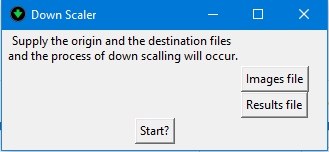

# Basic Image Downscaler:

Basic python script that takes images, and downscales them to 70 x 70 dimensions without changing the aspect ratio. The program is coupled with a basic GUI that you feed the image folder and the destination folder (all user defined) into for the process to begin. The required modules are included in the ***requirements.txt*** file.

## Operation and Images Source:

This is inteded to be used with 224x224 images sourced from the Google Teachable Machine online tool. This is due to the easy nature of capturing a big amount of pictures at one go.
Just go to [Teachable Machine](https://teachablemachine.withgoogle.com/train/image), collect the samples at your own leisure with their awesome online tool, and download the zip file containing the images. Run the downscaler to prepare the data into the agreed upon dimensions (70x70), and that should be it! An exe file is added for windows machines for easier usage. You can just run the exe file (after extracting from the 5 archive files using a tool like 7-zip) without any needed setup or even python being installed.
